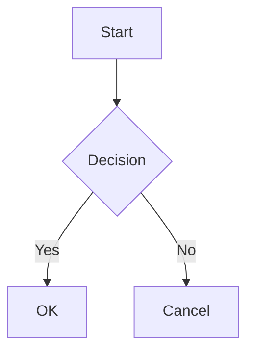

# markfluence

The best Markdown to Confluence converter. Direct AST-to-XML conversion with no HTML intermediate step. Modern, fast, correct.

## Features

- **Direct conversion** — Markdown AST → Confluence Storage XML (no HTML step)
- **Full GFM support** — Tables, task lists, strikethrough, autolinks
- **Mermaid diagrams** — Rendered to PNG with ELK layout engine
- **Admonitions** — `[!NOTE]`, `[!WARNING]`, `[!TIP]` → Confluence info panels
- **Smart sync** — MD5-based change detection, only uploads when content changes
- **Local images** — Automatically uploaded as attachments
- **Frontmatter** — Control page ID, title, and labels via YAML

## Quick Start

1. Set up your Confluence credentials:

```bash
export CONFLUENCE_DOMAIN=mycompany.atlassian.net
export CONFLUENCE_SPACE=DOCS
export CONFLUENCE_EMAIL=you@example.com
export CONFLUENCE_API_TOKEN=your-api-token
```

2. Sync your markdown files:

```bash
# Sync a single file
npx markfluence README.md

# Sync a directory
npx markfluence docs/

# Dry run (see what would be synced)
npx markfluence --dry-run docs/
```

Requires Node.js 20+.

## Environment Variables

| Variable | Description |
|----------|-------------|
| `CONFLUENCE_DOMAIN` | Your Confluence domain (e.g., `mycompany.atlassian.net`) |
| `CONFLUENCE_SPACE` | Space key (e.g., `DOCS`) |
| `CONFLUENCE_EMAIL` | Your Atlassian account email |
| `CONFLUENCE_API_TOKEN` | [API token](https://id.atlassian.com/manage-profile/security/api-tokens) |

## CLI Options

```
Usage: npx markfluence [options] [files...]

Options:
  -d, --domain <domain>  Confluence domain
  -s, --space <key>      Confluence space key
  -p, --parent <id>      Parent page ID for new pages
  -u, --user <email>     Confluence user email
  -t, --token <token>    Confluence API token
  --dry-run              Show what would be synced without making changes
  --no-mermaid           Disable Mermaid rendering
  -v, --verbose          Verbose output
  -h, --help             Display help
```

## Frontmatter

Control page behavior with YAML frontmatter:

```markdown
---
title: My Page Title
confluence-page-id: 123456789
labels: [documentation, api]
---

# Content starts here
```

| Field | Description |
|-------|-------------|
| `title` | Override the page title (default: first H1 or filename) |
| `confluence-page-id` | Update an existing page by ID |
| `labels` | Array of Confluence labels to apply |

## Supported Markdown

### Basic Formatting

- **Bold**, *italic*, ~~strikethrough~~
- `inline code`
- [Links](https://example.com) and [anchor links](#section)
- Images (remote URLs and local files)

### Code Blocks

````markdown
```typescript
const greeting = 'Hello, World!'
```
````

Supported languages: `typescript`, `javascript`, `python`, `java`, `go`, `rust`, `bash`, `sql`, `json`, `yaml`, `xml`, `html`, `css`, and more.

### Tables

```markdown
| Name | Age | City |
|:-----|----:|:----:|
| Alice | 30 | NYC |
| Bob | 25 | LA |
```

### Lists

```markdown
- Unordered item
- Another item
  - Nested item

1. Ordered item
2. Another item

- [x] Completed task
- [ ] Pending task
```

### Admonitions

```markdown
> [!NOTE]
> This renders as a Confluence info panel.

> [!WARNING]
> This renders as a Confluence warning panel.

> [!TIP]
> This renders as a Confluence tip panel.
```

### Mermaid Diagrams

````markdown

````

Mermaid diagrams are rendered to PNG with ELK layout engine for better handling of complex flowcharts and subgraphs.

## License

[MIT](LICENSE) © Vladimir Urushev
